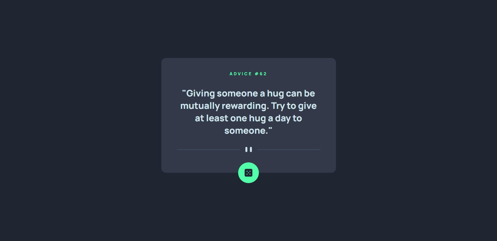

# 🤖Advice Generator App

Advice generator app challenge from Frontend Mentor created with React, SASS and Framer Motion

## 🖼️ Screenshots



## 🚀 Usage

Clone and run the Repository

## Installation

### First clone the repository form GitHub:

```shell
git clone https://github.com/JoseLuria/todo-app.git
```

### Then install the dependencies:

```shell
npm install
```

#### Finally, start the server with the following command:

```shell
npm run dev
```

## Built with

- [React](https://reactjs.org/)
- [Sass](https://sass-lang.com/)
- [Framer Motion](https://www.framer.com/docs/)

## License

[MIT](https://opensource.org/licenses/MIT)
